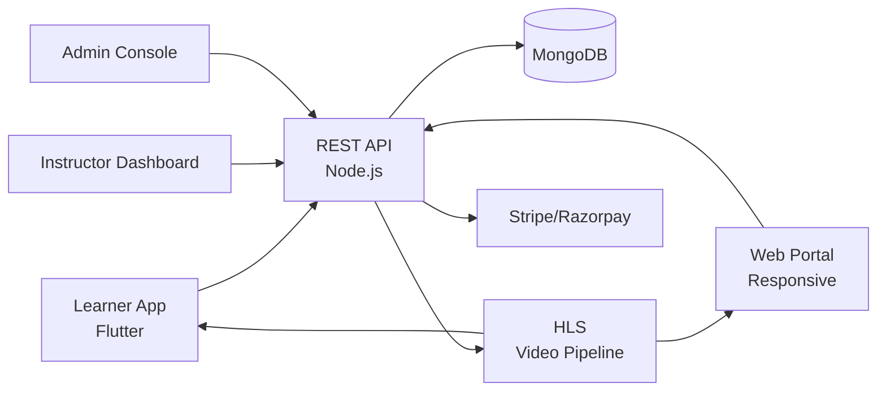

# Udemy Clone — White-Label EdTech & E-Learning Platform by Miracuves

**MXEdu** is a production-ready, white-label Udemy clone: a complete edtech platform with courses, live classes, quizzes, and instructor dashboard — delivered with **100% source code ownership** in **6 working days**.

> 🎓 **See it running before you talk to anyone.** Live learner app, instructor dashboard, and admin console — demo credentials are printed on the [solution page](https://miracuves.com/udemy-clone#demo). No sales call required.

---

## 🚀 Live Demos

| Environment | URL | What you can test |
|---|---|---|
| 📱 Learner App | [mas.mimeld.com](https://mas.mimeld.com) | Browse courses, enrol, watch, take quizzes |
| 🌐 Web Portal | [mxedu.mimeld.com](https://mxedu.mimeld.com) | Full learner experience in browser |
| 🎓 Instructor Dashboard | [Solution page → Demo](https://miracuves.com/udemy-clone#demo) | Courses, students, earnings, analytics |
| 🛠️ Admin Console | [Solution page → Demo](https://miracuves.com/udemy-clone#demo) | Courses, instructors, payments, analytics |

Demo credentials for all environments: **[miracuves.com/udemy-clone → Demo section](https://miracuves.com/udemy-clone/#demo)**

---

## ✨ What Makes This Udemy Clone Different

Most LMS scripts stop at "course pages." This platform ships with the features that actually run an edtech *business*:

- **Adaptive Bitrate Video** — HLS adaptive streaming with DRM protection — learners on slow networks still get smooth playback
- **Course Builder with Quizzes** — drag-and-drop course builder with auto-graded quizzes, assignments, and certificates — saves instructor hours
- **Multi-Instructor Splits** — revenue-share with multiple instructors per course — same model Udemy uses
- **AI-Powered Recommendations** — per-learner course suggestions based on goals, history, and behaviour — increases LTV
- **Built-In Live Classes** — low-latency WebRTC classes with whiteboard, breakout rooms, and recordings — what BYJU's uses for live learning

## 📦 Core Features

**Learner:** browse courses · enrol · watch lectures · take quizzes · earn certificates · track progress · discussion forums · multi-language

**Instructor:** course builder · video upload · quizzes & assignments · student analytics · Q&A · payouts · coupons

**Admin:** instructor approvals · course moderation · commission engine · coupon management · analytics reports

## 🏗️ Architecture

**Stack:** Flutter mobile apps · Node.js backend · MongoDB · HLS adaptive streaming · Stripe/Razorpay · WebRTC for live classes · Stripe, Razorpay, PayPal, regional gateways, multi-currency

## 📋 What’s Included

- ✅ Full source code — backend, web, mobile apps, panels (no encryption, no license locks)
- ✅ Deployment to your servers & app store submission assistance
- ✅ Your branding — white-label rename, logo, colors, domain
- ✅ 60 days post-launch support + 12 months of free updates
- ✅ Documentation & handover

**Pricing:** from **$2,899**, transparent on the [solution page](https://miracuves.com/udemy-clone/#pricing) — no "contact us for quote" games.

## 🆚 Why Not Build From Scratch?

Custom edtech platforms run $80k–$400k and 6–12 months. A proven white-label base gets you to market in 6 working days for a fraction of that, with your budget preserved for instructor recruitment and content marketing.

## 📚 Resources

- 📖 [Udemy Clone — Full Solution Page](https://miracuves.com/udemy-clone) (features, pricing, demos, FAQ)
- 💰 [How Much Does an EdTech App Cost in 2026?](https://miracuves.com/udemy-clone#pricing) pricing breakdown & what's included
- 📝 [Best Udemy Clone Script in 2026](https://miracuves.com/udemy-clone/blog/) features, pricing & launch guide
- 🧠 [Adaptive Video: Why EdTech Pipelines Should Look Like Netflix's](https://miracuves.com/udemy-clone/blog/) HLS, DRM, cost math
- ✅ [Miracuves Facts & Claims Ledger](https://miracuves.com/udemy-clone/facts/) every claim we make, verified

## 🏢 About Miracuves

[Miracuves Solutions](https://miracuves.com) builds white-label clone apps and custom software from Mumbai, India — 90+ ready-made solutions, live demos for every product, transparent pricing, and delivery in 6 working days. Operating since 2010.

**Talk to us:** [WhatsApp](https://wa.me/919830009649) · [Schedule a consultation](https://miracuves.com/schedule-consultation/) · [miracuves.com](https://miracuves.com)

---

### ⚠️ Note on This Repository

This repository is a product overview. The full source code is delivered to clients on purchase — see [what’s included](https://miracuves.com/udemy-clone/#included). For a hands-on evaluation, use the live demos above; credentials are public on the solution page.

*Keywords: udemy clone, udemy clone script, edtech, online learning, LMS, white label Udemy, course marketplace, Flutter edtech app, Node.js LMS*

---

<!--
══════════════════════════════════════════════════
TEMPLATE VARIABLE KEY — auto-generated from Netflix-Clone pattern
══════════════════════════════════════════════════
{APP_NAME}        Udemy Clone
{MX_NAME}         MXEdu
{CATEGORY}        EdTech & E-Learning Platform
{DEMO_WEB}        mxedu.mimeld.com
{PRICE}           $2,899
{SLUG}            udemy-clone
{SOLUTION_URL}    https://miracuves.com/udemy-clone/
{VERTICAL}        edu

See /tmp/verticals/edu.txt for the vertical config used to generate this README.
══════════════════════════════════════════════════
-->